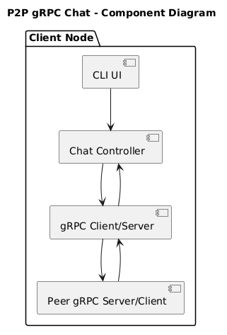
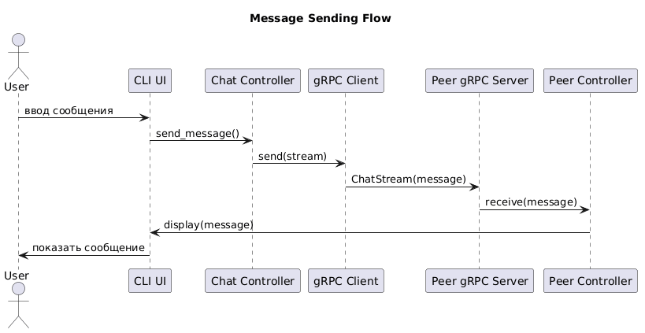

# Архитектура 

Каждый узел может подниматься в двух конфигурациях -- клиент и сервер.


## Описание компонентов

### CLI UI
* Ввод сообщений
* Вывод входящих сообщений
###  Chat Controller
* Управляет состоянием чата
* Отправляет/принимает сообщения
### gRPC Client
* Подключается к peer
* Отправляет сообщения через stream
### gRPC Server
* Принимает входящие сообщения
* Обрабатывает stream


## Диаграмма последовательности


## Диаграмма классов

```
+----------------------+
| ChatMessage          |
+----------------------+
| sender: str          |
| timestamp: datetime  |
| text: str            |
+----------------------+

+----------------------+
| ChatService (gRPC)   |
+----------------------+
| ChatStream(stream)   |
+----------------------+

+----------------------+
| ChatController       |
+----------------------+
| send_message()       |
| receive_message()    |
+----------------------+

+----------------------+
| GRPCClient           |
+----------------------+
| connect()            |
| send_stream()        |
+----------------------+

+----------------------+
| GRPCServer           |
+----------------------+
| start()              |
| handle_stream()      |
+----------------------+

+----------------------+
| CLI                  |
+----------------------+
| run()                |
| print_message()      |
+----------------------+
```